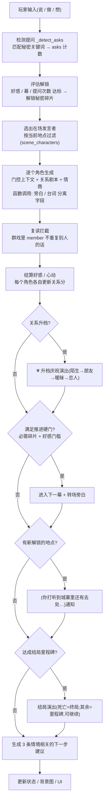
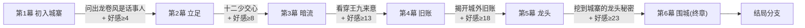
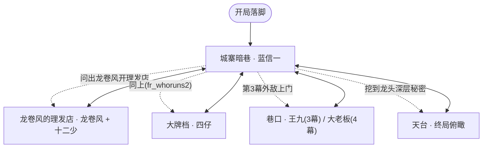
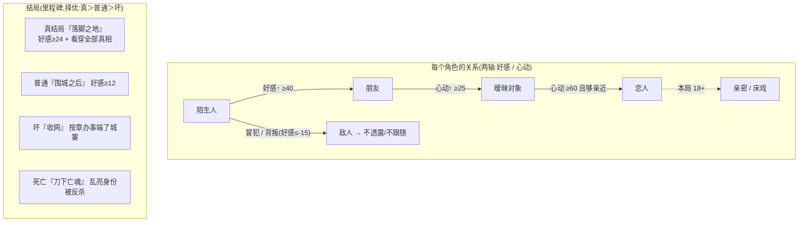
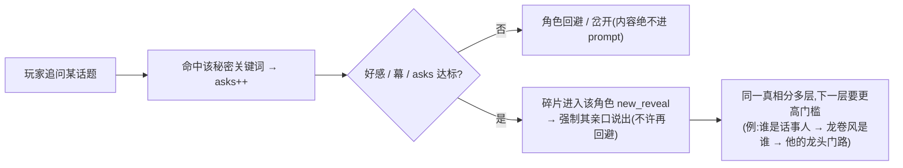

# 《九龙城寨·龙头》功能流程示意图

> 当前引擎 + 剧本的实际机制。Mermaid 图,GitHub/VSCode(Markdown Preview Mermaid)可直接渲染。

## 1. 单回合引擎流程(玩家每说一句发生什么)

## 2. 主线六幕推进(硬门:必需碎片 + 好感门槛)

## 3. 地点解锁 + 人物分布(探索→相遇)

规则:角色钉在各自地盘,玩家走到哪才遇到那里的人;**关系够近**才能「邀同行」把人带走;地点要**有人亲口说出地名**才解锁。

## 4. 关系流转 + 结局

## 5. 秘密分层解锁(gated-RAG:门控后才进 prompt)

八大秘密 / 14 碎片,层层递进,越接近真相门槛越高;真结局要挖到最深两层(城寨的龙头 + 他早看穿了你)。
